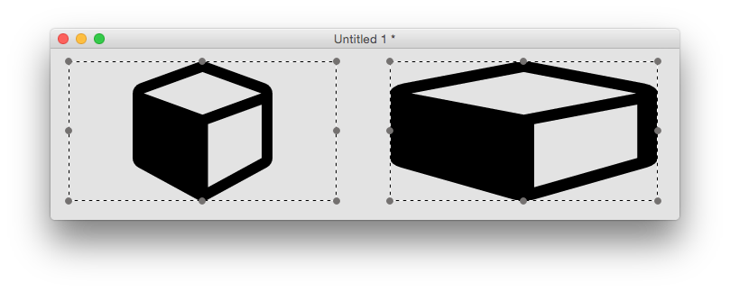
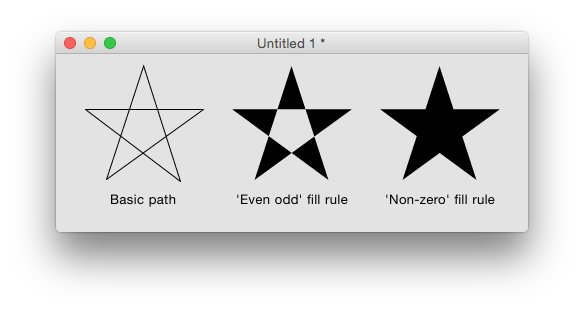

# SVG Path Widget
The SVG path widget can be used to display SVG paths as filled shapes, as stroked lines, or both. It has a
number of properties which control how the path is displayed.

## Creating an SVG Path
An SVG Shape widget can be created by dragging it out from the Tools
Palette, where it appears with the following icon:

<svg viewBox="0 0 65 40" style="display:block;margin:auto" width="auto" height="50">
  <path d="" />
</svg>

Alternatively it can be created in script using:

	create widget as "org.openxtalk.widget.svgshape"

## Paths
The SVG Shape displayed by the widget is either one of the named ‘preset’
paths, or any SVG path string. Setting either the `iconPresetName`
property or the `iconPath` property will override any setting of the
other property. The `iconPresetName` is one of the preset icons which
can be listed using the `iconNames()` function, or selected via the
property inspector. Clicking the currently set icon in the property
inspector will bring up the icon picker, allowing you to pick one of the
preset icons. Setting one of the preset icons will cause its iconPath
property to be set to the path of the current icon. If there is no
preset path that fulfills your requirements then you’ll have to set the
`iconPath` property to the SVG path of the image you want. Some
information on extracting valid SVG paths from images are discussed at
the end of this document.

## Highlighting
The `hilite` property can be used to alter the appearance of the svg
path widget to indicate it has been clicked, for example. The fill color
of a highlighted SVG Shape widget is determined by its `hiliteColor`.
Although this effect can also be achieved by changing the `foregroundColor`
of `foregroundPattern` property, the advantage of setting the `hilite` property
is that the `hiliteColor`, if empty, will be inherited. Thus you can ensure
consistency of highlight colors by setting the `hiliteColor` or of the
group or stack containing the widget.

## Rotation and Reflection
The `angle` property can be used to rotate an svg path. This can be
handy if you need to tweak one of the preset paths, for example to make
a finger point at something from a slightly different direction:

The `flipped` property can be used similarly. For example, here it is
used in conjunction with the `angle` property to make a fire
extinguisher icon face the other way.

## Aspect Ratio
The `maintainAspectRatio` property determines whether the path is
stretched to fit the object bounds or not. For example, the cube icon
will always be a cube if `maintatinAspectRatio` is true, but can be
stretched to a cuboid if not.

## Fill Rule
SVG paths can cross over themselves, which causes an ambiguity when
determining what exactly constitutes the interior of the path (for
filling purposes). The `fillRule` property controls how the engine
chooses what to fill. Take for example a five-pointed star, defined in a
simple way using a moveTo command and five lineTo commands, e.g.

	M4,47h117l-95,69 36-111 36,111z

The two available fill rules work by determining how many path segments
are crossed by a straight line going infinitely in one direction from a
given enclosed region. Using the above example, starting anywhere inside
the central pentagon of the star, such a line would always cross 2 path
segments. The ‘even odd’ fill rule states that a region should be filled
if this number is even, and not filled if it is odd. The ‘non-zero’ fill
rule states that a region should be filled if this number is non-zero.

So for the five-pointed star example above, we have the following
results:

## Width and Height
All UI objects have width and height properties, and the SVG path
widget is no different. However, these do not necessarily reflect the
actual bounds of what is drawn – for example if the
`maintainAspectRatio` property is set to true, as can be seen in the
cube / cuboid example above, there may be a significant difference.
The SVG path widget has read-only `scaledWidth` and `scaledHeight`
properties which return the width and height of the path as it is
currently being rendered.

## How to Get SVG Path Strings
Many image manipulation programs allow images to be exported as SVG, and
there are many SVG files available online, for example at Open Clipart,
however these cannot always be converted into simple SVG paths.

If an SVG file consists of a simple polyline element, you can often
convert it to the correct form by putting M (moveTo command) before the
first co-ordinate, L (lineTo command) before the second co-ordinate, and
adding Z (closePath command) at the end. This works for example when
creating a polyline svg using an online drawing website such as Vector
Paint.
